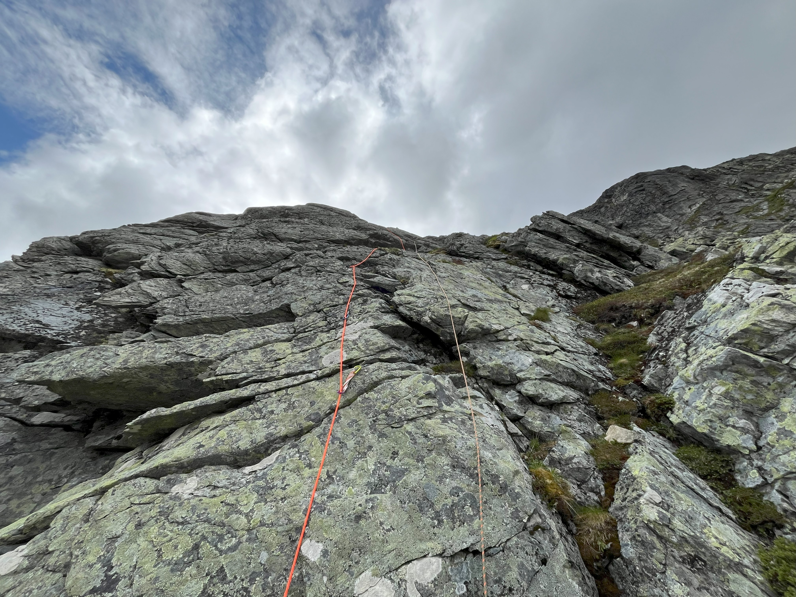
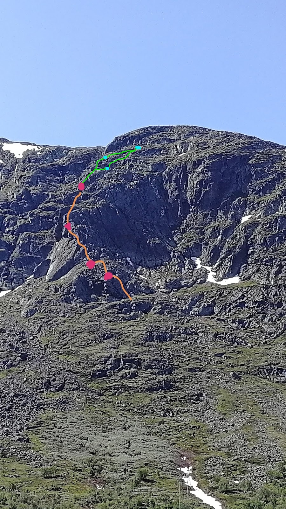

# Nordveggen på Bjøbergnuten

It is a trad route around the grade 3 to 4. It is made more challenging with the large amount of loose rocks. The original route indicated 4 rope lengths, we would recommend a few more to get to the final (big) ledge.

## GPS Coordinates

Elevation: 1290 m

Latitude: 60.939862 N

Longitude: 8.161972 E

## Parking

One can park in one of the inlets off the side roads (gravel). Make sure to park in such a way you are not in the way of any traffic coming out of these roads.

Elevation: 1120 m

Latitude: 60.942104 N

Longitude: 8.175432 E

## Approach

One has to cross over the field and bushes from the main road to the start. From the road one has a good view on where the climb starts and so can carve out a path.

## Starting point

The ledge one starts on is marked with a cairn. The start is a diagonal crag over a slab-like section besides a small cave.

## Topo

> There were many loose rocks and sections. So be careful when climbing and properly test your placements.

The route is effectively climbing from ledge to ledge. There are plenty of places to place protection, but beware of the loose rocks and slabs. We had several placements that looked right, until we tested them and the rock plates started moving. There are several ways up to each ledge, some slightly harder than others, but all doable in the grade 3 to 4+ range.

We used an topo from a blogpost we found, however, we did climb it in more pitches further up. We tried to indicate our route on the same topo.

The most important one is to find the large ledge to finish the route, for this one has to aim to the right (see image below). It can be beneficial to focus on a more right-way route for the final pitch.

## Descent

The end of the rout is on a big ledge, which one can walk towards the right to then on the backside of the mountain, walk down via a valley. For a large part it goes towards and then follows the power lines back down to the main road.

## References

- [Original Topo and blogpost](https://heihaaklatring.blogspot.com/2020/06/nordveggen-pa-bjbergnuten.html)
