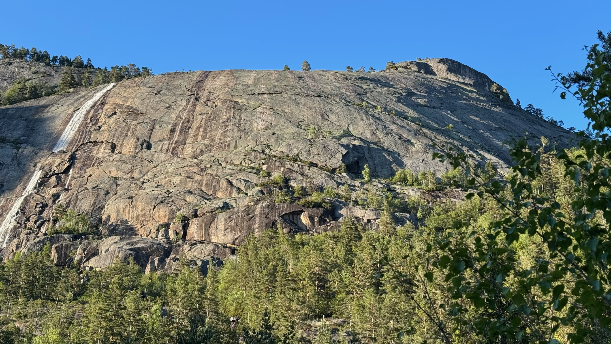
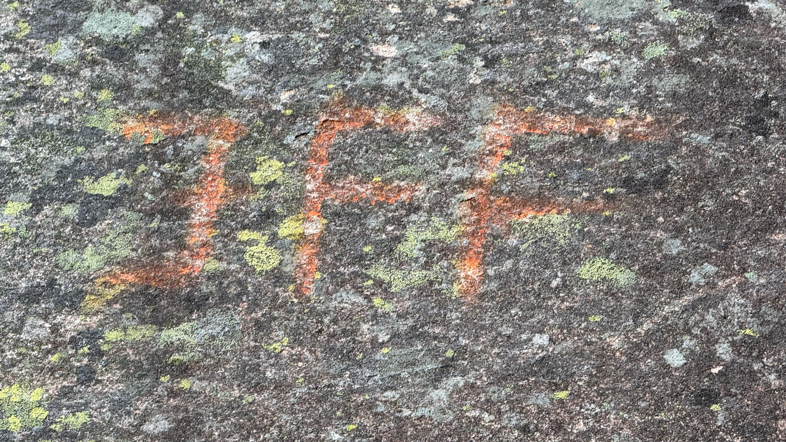

# Just For Fun

It is a 4+ mixed climbing route on Troldhaugen of about 200 meters (4 rope lengths) with bolted anchors.

## GPS Coordinates

Elevation: 404 m
Latitude: 58.978512
Longitude: 8.357576

## Parking

There is no dedicated parking spot available, however, there is a gravel road that leads to a campsite. One can park at the entrance of the gravel road or further down, closer to the campsite or at the end of the road.

Elevation: 282 m
Latitude: 58.977090
Longitude: 8.343916

## Approach

There is no clear path to follow and some path finding is required. The approach starts by following the gravel road till its end. Then one has to cross a small river, winding down towards the Dåstjønn lake. There is an old path indicated with orange dots on rocks, which will lead up towards Troldhaugen. In general, the dots, once found, are easy enough to follow, albeit it being in places hard to spot the next one. They follow a path up where boulders (and probably water) have come down the mountain. Therefore it is advisable to try and find this "boulder stream".

## Starting point

The starting point of the route is marked with big orange letters "JFF", hard to find, but also hard to miss once you are at the start.

## Descent

There should be a path around the back of Troldhaugen, leading back towards teh start. However, if that path is as good as the approach, it will be a tricky one to follow. Luckily the anchor points were bolted and so we could rappel down.

## References

- [Climbing notes we used for climbing, written by Hans Bräuner-Osborne](https://www.climb.dk/Nissedalen1.html)
- [Troldhaugen on 27Crags.com](https://27crags.com/crags/troldhaugen)
- [Dåstjønn lake on Google Maps](https://www.google.com/maps/place/Ron+bru/@58.9792585,8.3147756,15z)
- [Old guide book for Nissedal - Overview Troldhaugen - page 37](https://www.yumpu.com/no/document/read/8721842/frer-nissedal-osi-fjell/36)
- [Old guide book for Nissedal - Just for Fun topo - page 39](https://www.yumpu.com/no/document/read/8721842/frer-nissedal-osi-fjell/39)